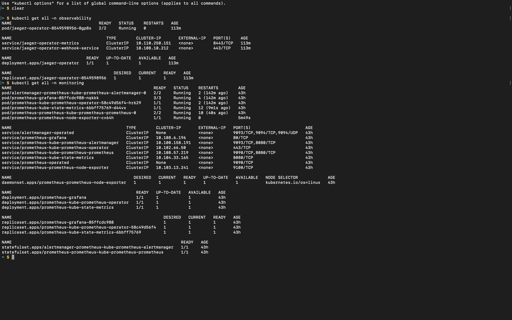
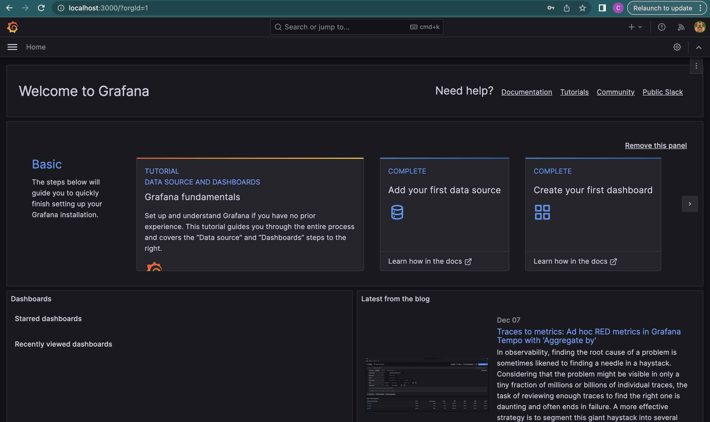
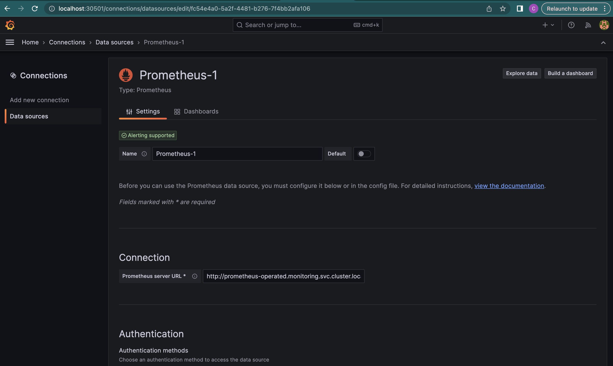
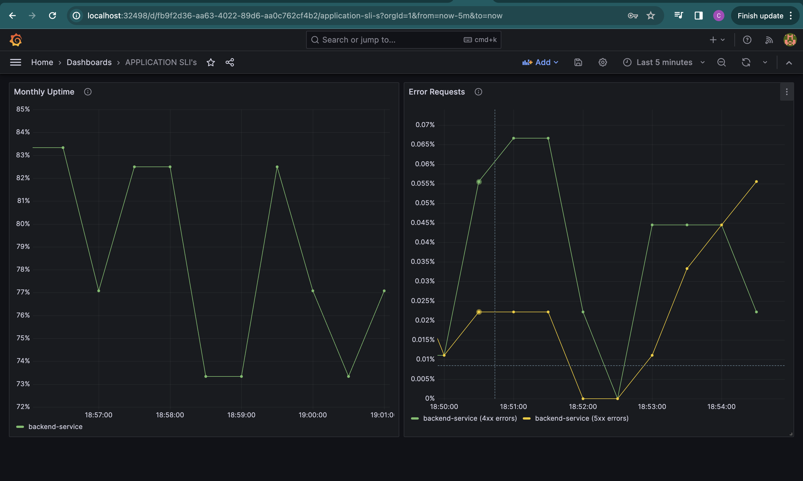
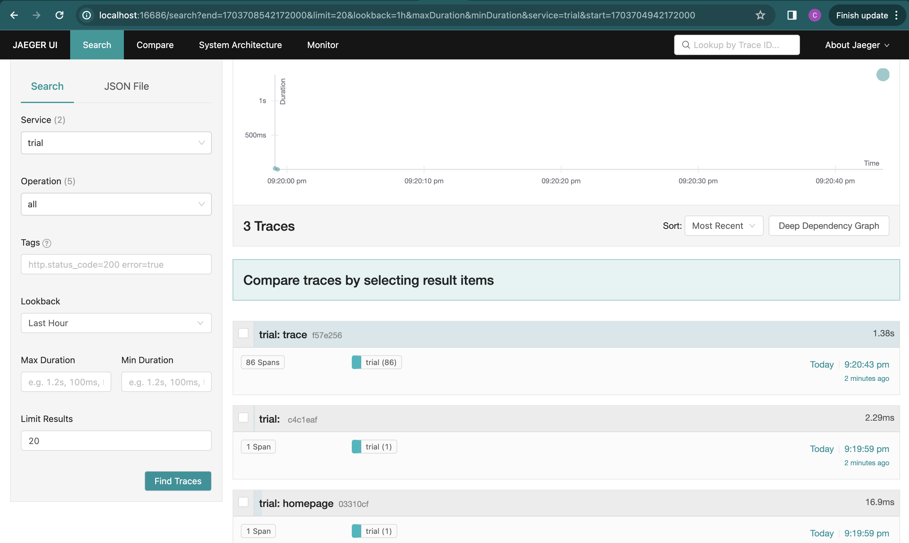
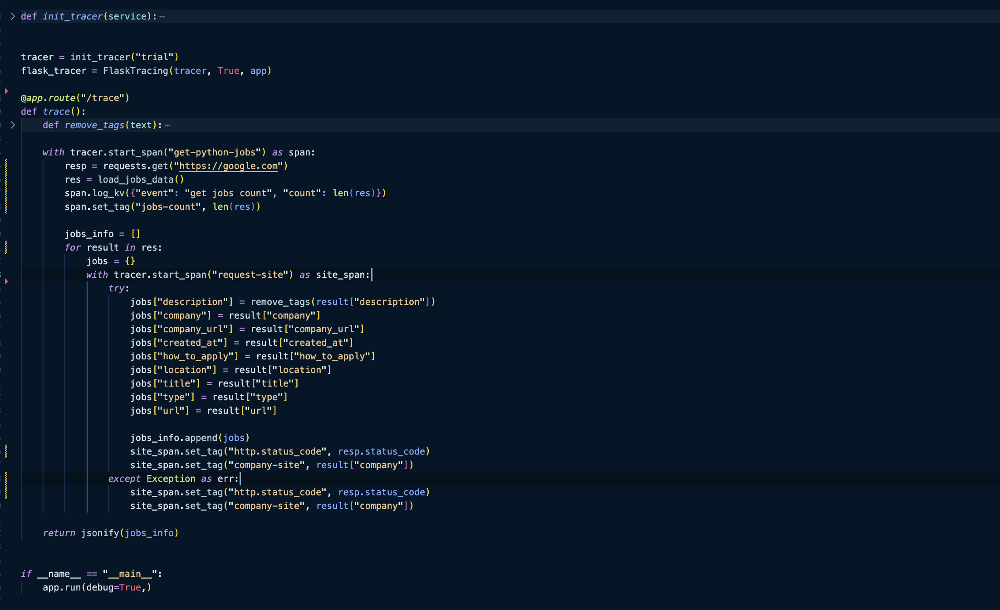
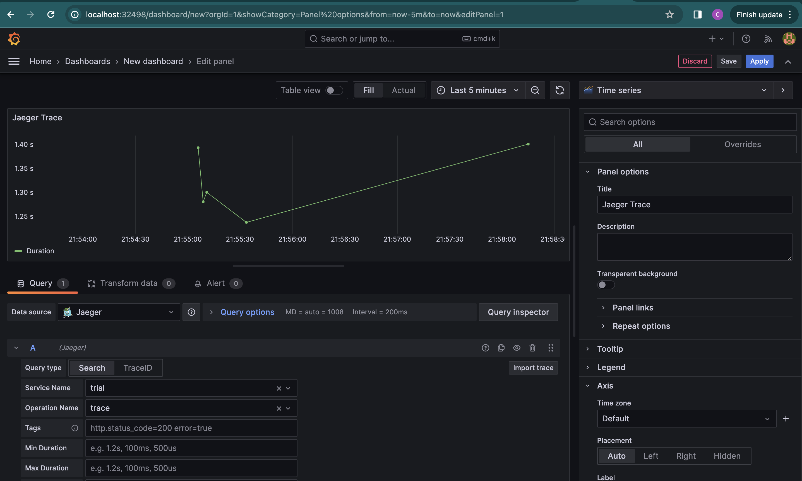
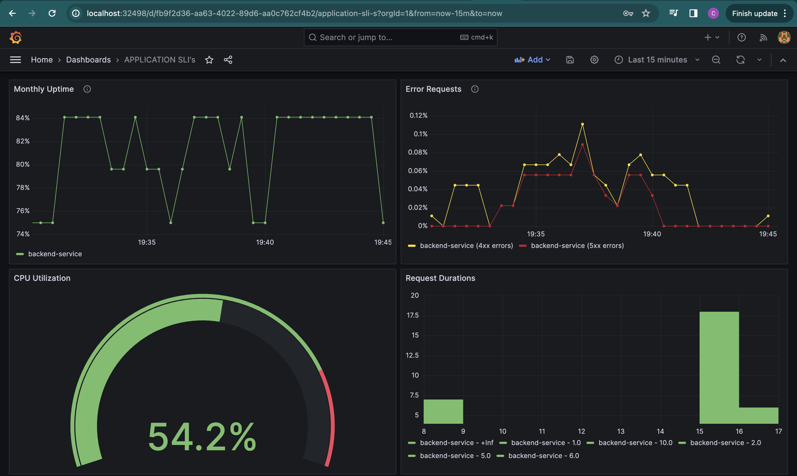

**Note:** For the screenshots, you can store all of your answer images in the `answer-img` directory.

## Verify the monitoring installation

*TODO:* run `kubectl` command to show the running pods and services for all components. Take a screenshot of the output and include it here to verify the installation

## Setup the Jaeger and Prometheus source
*TODO:* Expose Grafana to the internet and then setup Prometheus as a data source. Provide a screenshot of the home page after logging into Grafana.

## Create a Basic Dashboard
*TODO:* Create a dashboard in Grafana that shows Prometheus as a source. Take a screenshot and include it here.

## Describe SLO/SLI
*TODO:* Describe, in your own words, what the SLIs are, based on an SLO of *monthly uptime* and *request response time*.

* 95% service uptime / availability monthly
* 95% of the total HTTP requests return a status code of 200 (success) monthly
* 99% of HTTP requests are resolved under 100ms for a duration of one month
* 5% of total requests return a status code of 5xx (5% error budget) per month

## Creating SLI metrics.
*TODO:* It is important to know why we want to measure certain metrics for our customer. Describe in detail 5 metrics to measure these SLIs. 

* Request Latency — this is the time taken to serve a request (usually measured in milliseconds).

* Traffic - this refers to the total amount of stress on a system from users demand (e.g. the number of HTTP requests per second).

* Error Budget / Error Rate -  the number of requests that return a failure response (e.g. number of HTTP 5xx responses). 
If an error budget is set at 10% for example, it means 10% of the total requests can fail and still be within the budget

* Saturation — the overall capacity of a service (e.g as the percentage of memory or CPU utilized), it could also mean the amount of 'units' of information a system can process in a given time

* Availability / Uptime — the percentage of time a system or service has been operational and available during a defined period could be a week or a month.

## Create a Dashboard to measure our SLIs
*TODO:* Create a dashboard to measure the uptime of the frontend and backend services We will also want to measure to measure 40x and 50x errors. Create a dashboard that show these values over a 24 hour period and take a screenshot.

## Tracing our Flask App
*TODO:*  We will create a Jaeger span to measure the processes on the backend. Once you fill in the span, provide a screenshot of it here. Also provide a (screenshot) sample Python file containing a trace and span code used to perform Jaeger traces on the backend service.

## Jaeger in Dashboards
*TODO:* Now that the trace is running, let's add the metric to our current Grafana dashboard. Once this is completed, provide a screenshot of it here.

## Report Error
*TODO:* Using the template below, write a trouble ticket for the developers, to explain the errors that you are seeing (400, 500, latency) and to let them know the file that is causing the issue.

TROUBLE TICKET

Name: John Doe

Date: 27/12/2023

Subject: API Requests to /star endpoint throws a 500 error

Affected Area: Backend Service (API)

Severity: High

Description: POST requests to the /star endpoint to add a new star returns a 500 status code

## Creating SLIs and SLOs
*TODO:* We want to create an SLO guaranteeing that our application has a 99.95% uptime per month. Name four SLIs that you would use to measure the success of this SLO.

* 99.95% of total requests are successful, return a status code of 2XX
* Less than 0.05% of HTTP requests return a 5XX error in a duration of a month
* Each service request resolves in 100 milliseconds or less
* The service is capable of supporting upto 1000 concurrent HTTP requests per second

## Building KPIs for our plan
*TODO*: Now that we have our SLIs and SLOs, create a list of 2-3 KPIs to accurately measure these metrics as well as a description of why those KPIs were chosen. We will make a dashboard for this, but first write them down here.

1. Average request response time
2. Number of sucessful concurrent requests processed
3. Ratio of requests returning a success (2xx) to those returning errors (5xx)

## Final Dashboard
*TODO*: Create a Dashboard containing graphs that capture all the metrics of your KPIs and adequately representing your SLIs and SLOs. Include a screenshot of the dashboard here, and write a text description of what graphs are represented in the dashboard.  

* Monthly Uptime Panel - displays the total number of successful requests within the specified timeframe.
* Error Requests Panel - displays the total number of 4xx and 5xx errors for the backend service.
* CPU Utilization Panel - shows the current CPU usage for the application.
* Request Duration Panel - displays request latencies (in milliseconds) as a histogram
